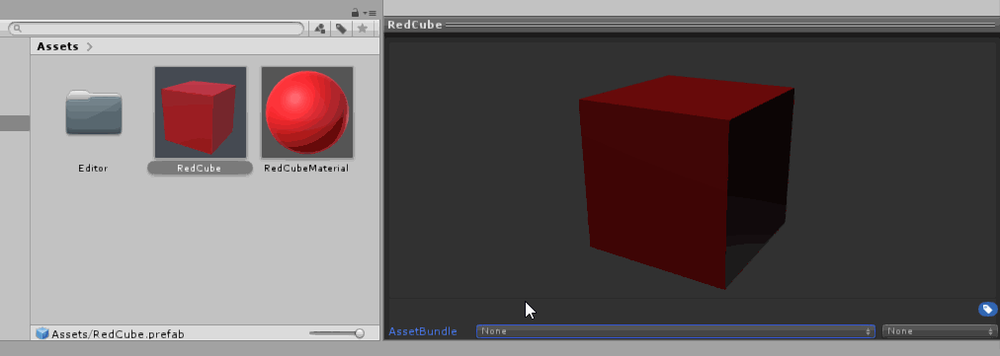
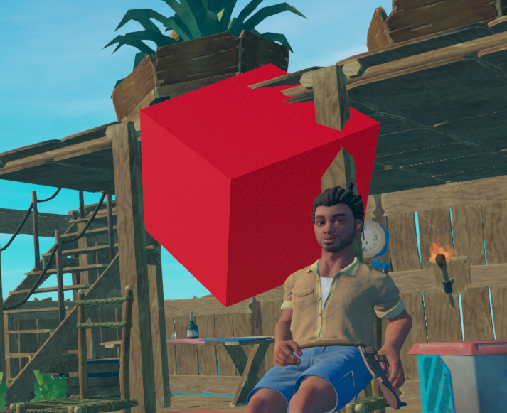

# 如何创建 AssetBundle 

###### 本教程旨在向您展示如何将资产导入游戏，例如 3d 模型、纹理、预制件、粒子等... 

---


让我们从需求开始吧！ 
 对于本教程，您将需要与第一个教程相同的要求。 
 1) 首先，新建一个与[如何创建模组项目中要求的版本相同的 Unity 项目 ](../how-to-create-a-mod-project/README.md) 
 2) 第一步完成后，下载[此文件](https://www.raftmodding.com/TeKGameRMods/AssetBundleBuilderByTeK.zip) 并将其放入您的 Unity 项目中，如下所示。   这将允许您构建资产包文件。 
   
   

 3) 将你的东西添加到资产包中，如下所示。 
   
   

 4) 一旦你的assetbundle中有所有东西，通过右键单击任意位置并单击 Build AssetBundles 来构建它，如下所示。 
 
   
   

 5) 如果您的assetbundle 已成功构建，您应该能够在 <code>Assets/AssetBundles</code> 中找到它；   找到它后，将其复制到您的 .cs 文件和 modinfo.json 文件所在的 mod 项目文件夹中，如下所示。 
    
   
   
 6) 现在让我们使用我们之前在[如何创建模组项目 ](../how-to-create-a-mod-project/README.md)教程中制作的模组将其加载到游戏中。打开您的 mod 项目并更改您的启动方法类型 <code>void</code>至 <code>IEnumerator</code>并将下面的代码复制到 start 方法中，如下所示；您还需要在您的模组中创建一个新变量，以便能够从模组中的任何位置访问资产包。 

<!-- tabs:start -->

#### **帮助图片**


>[!NOTE]
>如果 IEnumerator用红色下划线，只需添加 <code>using System.Collections;</code>在你的 mod 文件的顶部。 

#### **代码**

````csharp
AssetBundle asset;

public IEnumerator Start()
{
    AssetBundleCreateRequest request = AssetBundle.LoadFromMemoryAsync(GetEmbeddedFileBytes("tutorial.assets"));
    yield return request;
    asset = request.assetBundle;
    
}
````

<!-- tabs:end -->


 7) 加载一个资产包是好的，但是我们在卸载我们的模组时也需要卸载它。   所以，在你的 <code>OnModUnload</code>方法只需添加 <code>asset.Unload(true);</code>如下所示。 
    
   
  
 8) 现在，要从我们的资产包中加载一些东西，只需使用 <code>asset.LoadAsset\<T\>("assetname")</code>例如加载我之前添加到示例资产包中的 RedCube  ，我可以这样做 <code>asset.LoadAsset\<GameObject\>("RedCube")</code>如下所示。 
如果你做的一切都正确，你的资产现在应该在游戏中。  例如我的红色立方体在主菜单中产生.😃 
     
   
  
  
  
这就是它！   如果您遇到任何问题或在特定步骤被阻止，这可能会有点复杂，
     
   
   