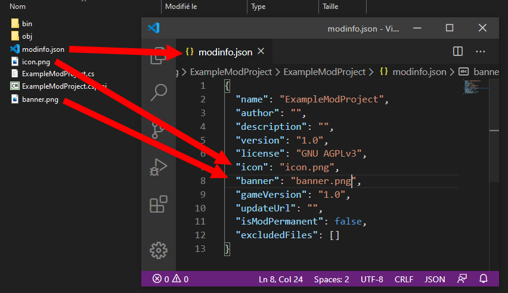
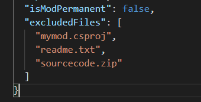

# modinfo.json 文件 

此页面旨在为您提供有关 modinfo.json 文件的所有必要信息。

---

##### 这是 modinfo.json 文件的所有字段的列表以及它们的简短描述/用法。  此表下方有关它们的更多信息。 
|  字段名称   | 描述  |
|  ----  | ----  |
| name  | 变量类型 :String   描述 :   你的模组的显示名称|
| author  | 变量类型 :String   描述 : 在我们网站用户名|
| description  | 变量类型 :String   描述 :  对您的模组的简短描述|
| requiredByAllPlayers  | 变量类型 :Bool   描述 :是所有玩家都需要mod才能工作吗？ |
| version  | 变量类型 :String   描述 :   你的模组的当前版本|
| license  | 变量类型 :String   描述 :   你的模组的许可证|
| icon  | 变量类型 :String / Path   描述 :   您的模组的图标。 （可以在模组管理器列表中看到）|
| banner  | 变量类型 :String / Path   描述 :   您的模组的横幅。 （可以在模组管理器列表中看到）|
| gameVersion  | 变量类型 :String   描述 :   你制作的 Raft 的版本|
| updateUrl  | 变量类型 : String / Url  描述 :   返回您的 mod 的最新可用版本的链接|
| isModPermanent  | 变量类型 :Boolean (true or false)   描述 :  定义你的模组是否是永久性的。 永久模组默认加载，无法卸载。 这个|
| excludedFiles  | 变量类型 :Array of strings / List of strings   描述 :  允许您指定不加载的文件。 不支持通配符。|

### con & Banner Fields 字段：  
##### 只需将图像添加到您的解决方案文件夹中  .cs 文件和  .csproj 文件是并编辑  modinfo.json 文件如下图。 

### UpdateUrl 字段： 
##### RaftModLoader 获取此链接以了解您的 mod 的最新可用版本是什么，如果当前安装的版本不等于此 url 返回的版本，则会说该 mod 已过时。
##### 我们的网站通过一个很好的自动化系统提供这项服务。  拥有 mod slug 后，可在以下链接中找到。
 <code>https://www.raftmodding.com/api/v1/mods/YOURMODSLUG/version.txt</code>

### requiredByAllPlayers 字段：
##### 如果此字段设置为 true 并且加载了 mod，它将踢出任何尝试加入但没有相同 mod 和相同版本的玩家。如果你的模组添加了新物品或新方块，这里必须要填true！所有玩家必须都加载方块才能进入 
### ExcludedFiles Field:
##### 这是一个简单的排除文件列表，如下所示。 
