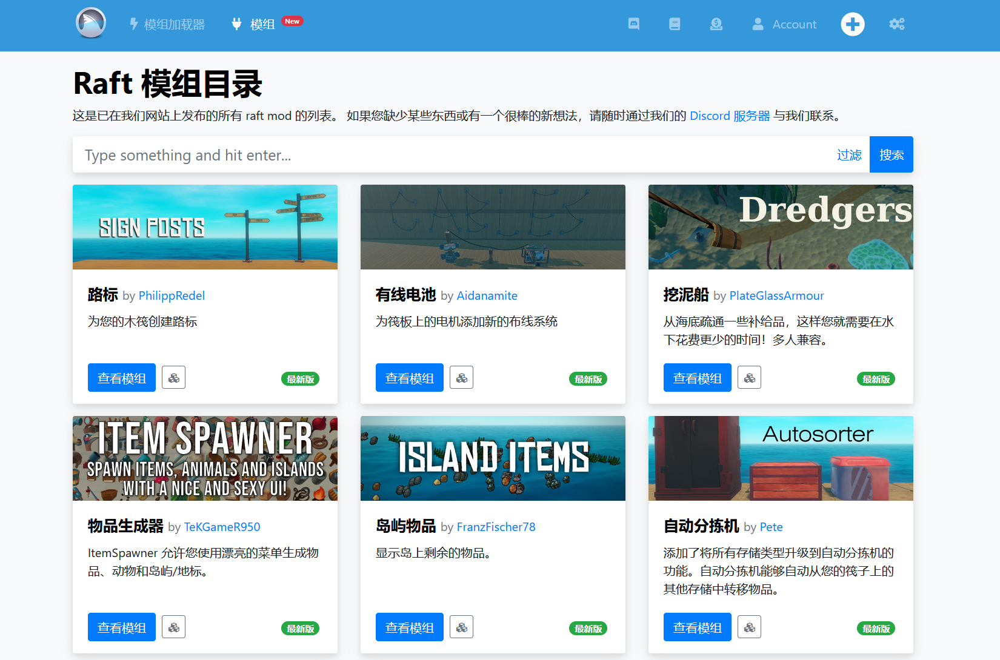
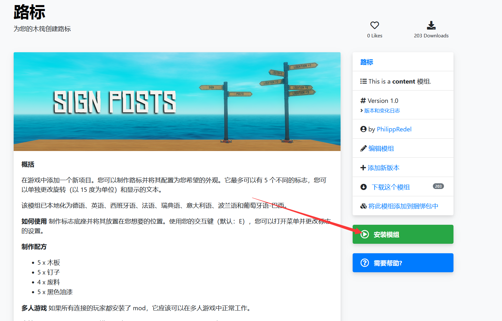
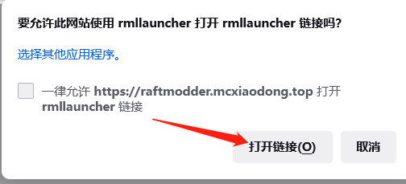
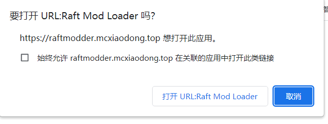
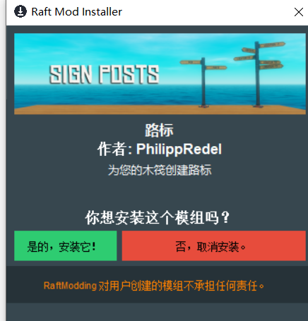

# 如何安装模组
---

本教程旨在向您展示如何使用 RaftModLoader 在 Raft 上安装 mod！

---

让我们开始第一步吧！ 

---
## 1.安装模组加载器 
如果您还没有这样做，请安装 [RaftModloader](https://raftmodder.mcxiaodong.top/download)。  请查看我们关于该主题的指南以获取详细说明。 
## 2. 寻找模组 
要搜索和查找您选择的模组，建议在[Raft模组目录](https://raftmodder.mcxiaodong.top/mods)滚动页面并单击您要查看的模块。 找到最受欢迎的模组列表。

###### 模组目录 - 使用搜索栏查找特定模组或浏览列表 
## 3.安装模组 
在模组页面上，您可以找到有关模组的所有信息。  要安装一个模组，只需按下大绿色 安装模组 按钮。
 
您的浏览器可能会询问您 raftmodder.mcixaodong.top 是否可以打开 Raft Mod Loader 来安装 mod。  点击 打开 允许它。  
 
 
如果单击绿色 安装模组 按钮后没有任何反应，请查看[点击此处](../)

浏览器要求您确认打开 Mod 安装程序 
## 4. 允许安装模组 
现在，Raft Mod 安装程序应该打开。  它将向您显示即将安装的模块，并再次询问您是否愿意这样做。点击 **是的,安装它!** 允许安装。 

 

###### Raft Mod 安装程序会询问您是否要安装特定的 mod。 
## 5.加载模组 
我们已经完成了模组的安装！   让我们看看如何在游戏中加载它。   使用启动器并单击 播放 按钮开始游戏。   游戏加载后，转到 **模组** 选项卡，如果模组有**加载**按钮，请单击它，如下所示。  你必须点击**加载模组**。 
如果您下载的模组没有**加载**按钮，但有一个蓝色按钮 ，如下图所示，它是永久加载模组，这意味着它默认加载，您不必处理它。 
 
###### 单击加载模组以加载模组。
  
######永久模组会自动加载 
## 6. 完成了吗？ 
如果一切顺利，模组状态应该是绿色的，文字应该是 RUNNING... 如下图所示。 
 
###### 加载后，您的 mod 应显示 Running... 状态。 
您的第一个 mod 现在已安装并正在运行