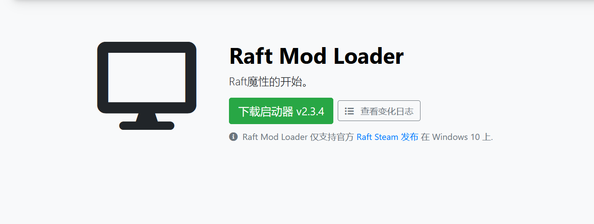
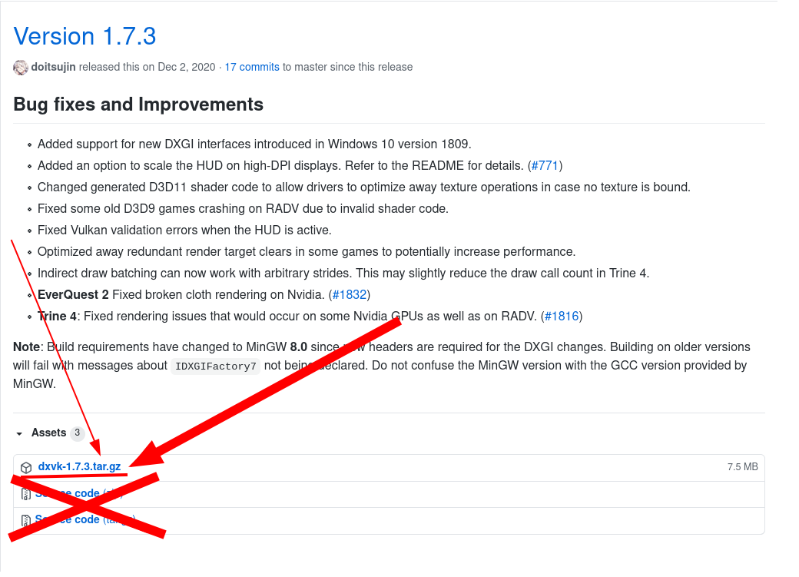

# 如何在 Linux 上安装 RaftModLoader 
本教程旨在向您展示如何在其他操作系统（不是 Windows）上安装 RaftModLoader。 

---
# 如何在Linux上安装RaftModLoader 
编写本指南的人喜欢Linux、免费和开源的东西，他使用 Bash 代替 PowerShell，使用 Clangd+Vim 代替 Visual Studio。在安装了 Ubuntu 并在上面玩了一些其他游戏之后，他发现了一个独特的软件： [Wine](https://winehq.org/)。这使他能够运行 Raft... .

继续，您需要做的第一件事是： 
## 1. 获取木筏 
转到您的 Windows PC，找到 Raft 安装文件夹（ 
解释）并将其复制到您的 Linux 计算机。在我的桌面上它被放置在 ~/Desktop/Raft，因此根据您所在的位置更改路径。 
## 2.下载启动器 
与您在 Windows 上所做的相同。进入[下载页面](https://raftmodder.mcxiaodong.top/download)，并将其放到某处（比如我放在 ~/Desktop/Raft- 我的 Raft 文件夹）。
 
## 3. 安装 Mono 和 .NET 4.6 
首先，如果你还没有安装 *winetricks*  在 Ubuntu 上，它只是 *sudo apt install winetricks* 下载 *Mono 5.0 .MSI* 并运行 *wine uninstaller*启动“添加和删除软件”对话框。  将其指向下载的安装程序并等待它完成。安装 Mono 后，您需要做另一件事：.NET 4.6。  它可以使用从终端安装 *winetricks dotnet46* 它会警告您缺少 Windows 模块安装服务，但这不是问题。 
## 4.（推荐）安装DXVK以获得更好的性能 
如果您的显卡支持 <code>Vulkan</code> 渲染，则不应跳过此步骤。从获取一个版本，将存档解压缩到 <code>\~/Downloads/</code>并从终端中运行它 <code>\~/Downloads/dxvk_x.y.zxyz </code>是版本的目录： 

    WINEPREFIX="$(dirname ~/.wine)/.wine" ./setup_dxvk.sh install

 
## 5. 像在 Windows 上一样使用 RaftModLoader 
通过 Wine 运行 *RMLLauncher:wine64 ~/Downloads/RMLLauncher.exe* 它会要求您提供 Raft 文件夹。  根据我的检查，更新很好，注入工作和 Raft 启动
已知的问题 
在 Alt+Tab 之后 Raft 不会响应 
我对此无能为力——这是许多其他 Unity 游戏都会出现的问题，尤其是在 Wine 上运行时。  据我所见，将焦点更改为另一台显示器上的窗口不会触发此问题。 
注入失败 
稍等片刻，Raft 将打开并且模组仍然可以工作。 
该程序 csc.exe意外停止 
我认为这可以通过使用 Mono 来解决 csc但这可能会涉及 RML 代码的更改。 
由@RMuskovets撰写 

