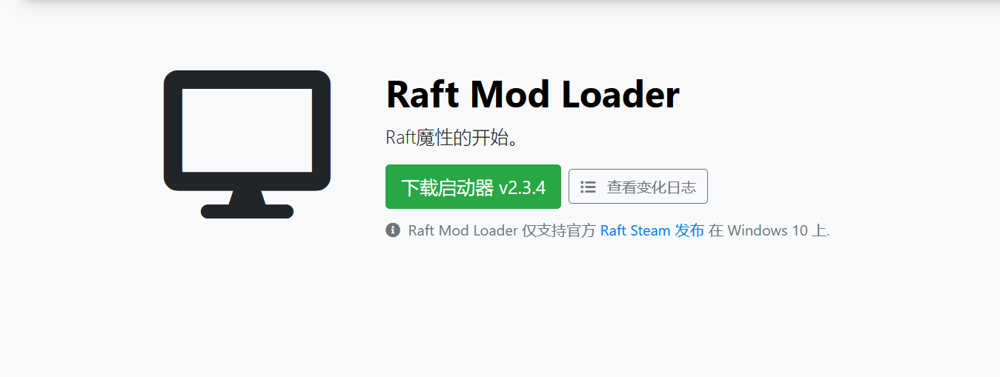

# 如何安装 RaftModLoader 

本教程旨在向您展示如何安装 RaftModLoader。

---
让我们开始第一步吧！ 
## 1. 下载启动器 
首先，在[此处](https://raftmodder.mcxiaodong.top/download)下载我们的启动器的最新版本。   然后将其放置在您想要的任何地方，但我们建议您将其保留在桌面或易于使用的地方。 
单击绿色按钮从我们的网站下载最新版本的启动器 

## 2. 服务条款 
通过打开您下载的文件启动启动器。   首次启动时，系统会提示您接受我们的服务条款，这是使用我们的软件所必需的。   按“同意”，即表示您确认您接受它们。   如果您对数据隐私有任何疑问，请随时通过[开黑了](https://www.kookapp.cn/app/channels/2357391926592835/7880396329959789) 或 电子邮件
与我们联系。 
如果您接受我们的服务条款，请单击绿色按钮 
## 3.安装 
接受服务条款后，启动器将下载并安装所有必需的文件，如下所示。  你不需要在这里做任何事情，只是等待。大小在100M左右

单击“下载”部分以查看下载进度 
## 4. 启动改装 Raft 
最后，一旦启动器下载并安装了所有必需的文件，<code>Play</code>按钮将如下所示。  要启动 mod loader，请按 <code>Play</code>按钮，游戏将开始。  每次你想玩模组时，你必须启动启动器并点击 <code>Play</code>. 按下启动器中的<code>Play</code>按钮开始改装 Raft 
## 5.游戏内 
然后，一旦游戏加载完毕，您应该在 Raft 主菜单中有一个新菜单，如下所示。  如果新菜单未在游戏中显示，请查看我们的故障排除指南： 
当您通过 RML 启动器启动 Raft 时，应该会显示此菜单 
## 6. 后续步骤 
恭喜！  如果你做到了这一步，你已经成功安装了 RaftModLoader！  现在你可能想要安装一些实际的模组。  单击下一个链接以获取我们的安装模组指南： 
如果某些事情没有按预期工作，也许看看我们的故障排除指南： 
给你！  RaftModLoader 现已安装！  您现在可以享受使用很棒的模组玩木筏的乐趣了！ 