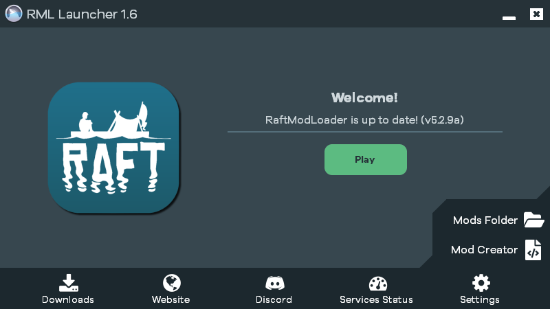
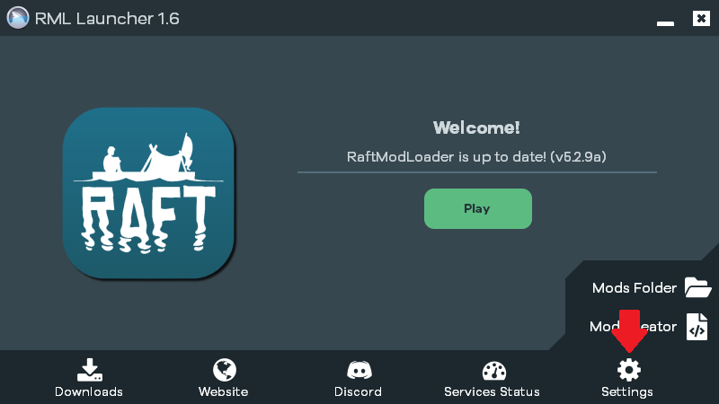
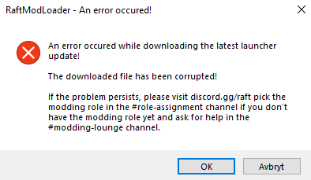

#故障排除 
######当软件没有做它应该做的事情时...... 
---

#####如果安装 mod loader 没有按预期工作，请不要担心。   请查看以下文档，该文档描述了安装 mod loader 的一些更常见的问题。   如果这些都不起作用，请加入我们的 [开黑了](https://www.kookapp.cn/app/invite/mtR5bR) 中的[#获取帮助](https://www.kookapp.cn/app/channels/2357391926592835/7880396329959789) 频道寻求帮助或通过邮箱联系我。看到会回复。 

---
怎么了？ 
---
首先，我们需要找出问题所在。  以下哪项描述最能描述您的问题？  如果弹出错误，请尝试查找带有描述错误文本的标题。 
  
- [游戏内菜单不显示](#游戏内的菜单不显示) 
- [我收到 CA3 错误](#我收到)
- [我遇到了 DXA 渲染问题]()
- [下载的文件已损坏](#下载的文件已损坏)
- [其他/本指南无法解决我的问题](#)
---
  
#游戏内的菜单不显示
这是一个相当普遍的问题，所以不用担心。  请执行以下步骤： 
###1.打开启动器 
如果 Raft 仍在运行，请关闭它并打开启动器应用程序。 

 
这是我们需要的应用程序 

###2.打开设置 
点击设置 ⚙ 图标以打开启动器设置。 

###3.改变启动方式 
在设置中，有一个用于更改启动方法的选项。  你可以选择之间Steam,  Executable和 Force Start.  如果您以前从未更改过此值，则当前值应为 Steam.  请选择 Force Start. 

 
在设置菜单中，选择“启动方法”面板中的“强制启动”。  

###4.开始游戏 
现在，通过单击齿轮关闭设置 ⚙ 再次按下 Play开始游戏。 
###5.有效果吗？ 
如果这可行，您现在应该会在游戏中看到改装菜单。  如果您看不到下图的灰色菜单，请返回步骤 3 并尝试将启动方法更改为 Executable. 

---

#我收到"CA3 错误"或"DXA渲染问题"

这是 Raft 本身的问题，不幸的是需要手动操作.请访问并向@ModMail 发送消息.版主将查看您的问题。 

---
#下载的文件已损坏

此问题与我们的 [启动器](https://raftmodder.mcxiaodong.top/download)尝试下载必要的文件但未能下载有关。   
其原因可能是以下之一： 
- 您的互联网连接或我们的服务器出现了小故障。 
- 您的防病毒程序对此下载或我们的一般应用程序有误报。   

###"下载的文件已损坏"的解决方案： 
下面，我们将 验证文件的完整性。这是一个 Steam 工具，允许检查和修复损坏的游戏文件。 
1.打开 Steam 并打开 库 选项卡。 
2.右键单击 Raft 选择 属性 .然后在弹出菜单
3.在菜单中，选择 本地文件 选项卡。 
4.单击“ 验证游戏文件的完整性” 按钮。 
5.如果该工具发现任何损坏的文件，它将自动修复它们。 
6.完成后，您可以关闭窗口。 
7.现在，尝试再次打开启动器。 
8.它现在有效吗？如果错误不断出现，这可能与您的防病毒程序有关。 

---
#其他/本指南无法解决我的问题 
看来你的问题有点不常见。你可以在[开黑了](https://www.kookapp.cn/app/invite/mtR5bR)#获取帮助 频道提出问题。