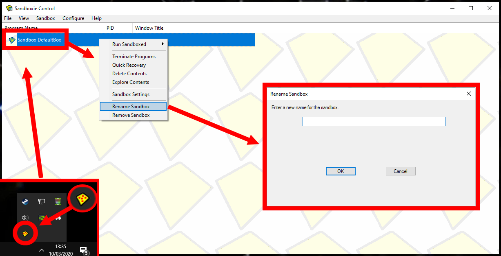
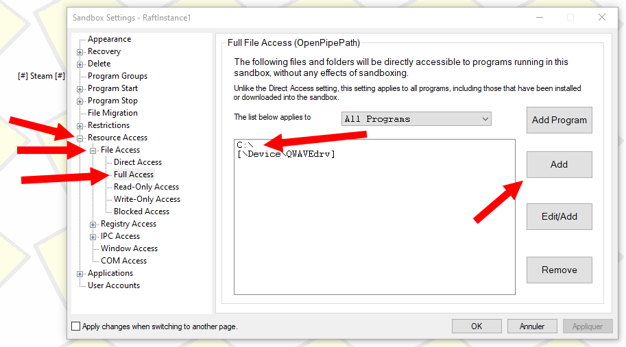

#如何运行多个 raft 实例 
######一个简单的教程，向您展示如何在同一台计算机上使用不同的 Steam 帐户运行多个 raft 实例。  所以你可以自己玩（对于编写多人模式来测试它们很有用） 
---

大家好！
今天我将向您展示如何同时运行多个 raft 实例。 
要开始使用本教程，您需要满足以下要求： 
- [沙盒](https://www.sandboxie.com/)：允许您在隔离环境中运行程序。从我们的镜像下载它,因为他们的网站会询问大约 20 个要下载的个人问题。 
​- [创建第二个RaftSteam账号](https://www.sandboxie.com/): 由于您将运行两个 raft 实例并想要连接到它，因此您需要 2 个 raft 帐户，这很糟糕，但它是唯一的方法。 

##那么，让我们开始吧！ 
### 1-1 ) 安装沙盒 
安装沙盒就像安装任何软件一样简单，只需运行可以从我们的镜像下载的安装 
。 
  然后像普通程序一样运行安装过程。 
### 1-2）配置沙盒 
打开任务栏左下角的沙箱，如下图，右击"沙箱默认框"，点击"重命名沙箱 "，如下图。 

通过右键单击沙箱并单击"重命名沙箱"来更改沙箱名称 
更改沙盒名称后，再次右键单击它，单击"沙盒设置 "并进入以下类别： 
   - 资源访问 
   - 文件访问 
   - 完全访问 
现在，单击"**添加**"以允许您的隔离环境访问您的主驱动器或必要的驱动器。 

如果我们强烈建议您允许隔离环境访问整个驱动器，因为它包含带有世界文件夹的 AppData 文件夹、Raft 设置、Mod Loader（如果您使用它等）... 

## 2-1 ) 复制您的 Steam 软件。 
为了使用两个或更多帐户，您需要在某处创建一个新文件夹，以便将您的第二个 Steam 安装在某处。
 在此文件夹中，从您的主蒸汽文件夹中获取以下文件 
- Steam.exe 

- steamapps/common/Raft 文件夹。 

## 2-2 ) 在隔离环境中安装 Steam。 
转到您刚刚创建的第二个 Steam 文件夹，右键单击 Steam.exe  ，单击"运行沙盒 "，然后选择您的沙盒并选中"以 UAC 管理员身份运行"，如下所示。 
  Steam 将在一个孤立的环境中启动，当您将它们悬停时，您可以看到它在其中运行，其边框周围有黄色轮廓。 
  
## 2-3 ) 安装 Raft 并运行它。 
现在您已安装 Steam 并在隔离环境中启动它，请登录到您的第二个 Steam 帐户，该帐户拥有您的第二个 raft 帐户。
 然后您只需单击"安装 Raft"，它会发现现有文件并下载一些文件，然后您只需启动 raft 即可立即运行！ 